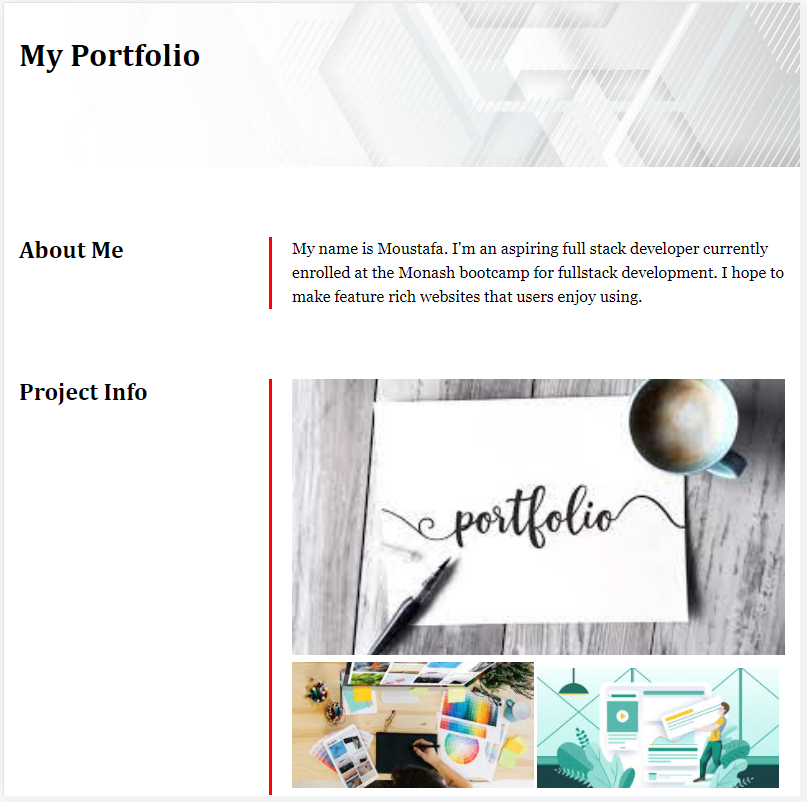
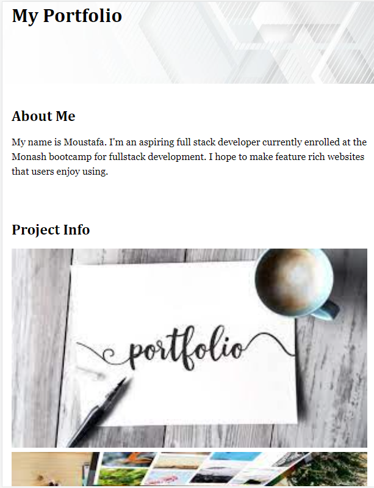
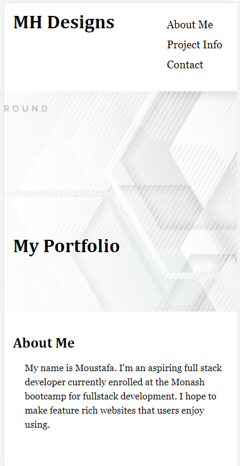

# Creating a personal portfolio using HTML and CSS

## Project definition

The task for this assignment was to create from scratch html and CSS code for a portfolio webpage that is responsive for all types of media.

## Images

desktop

mobile

edited nav bar for mobile

## LICENSE

MIT
